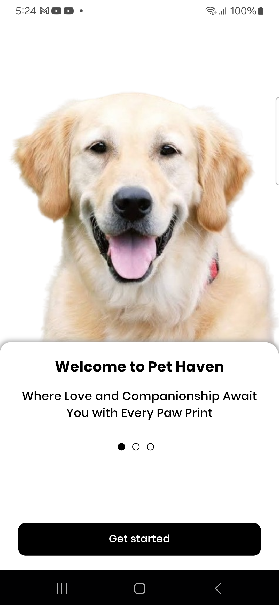
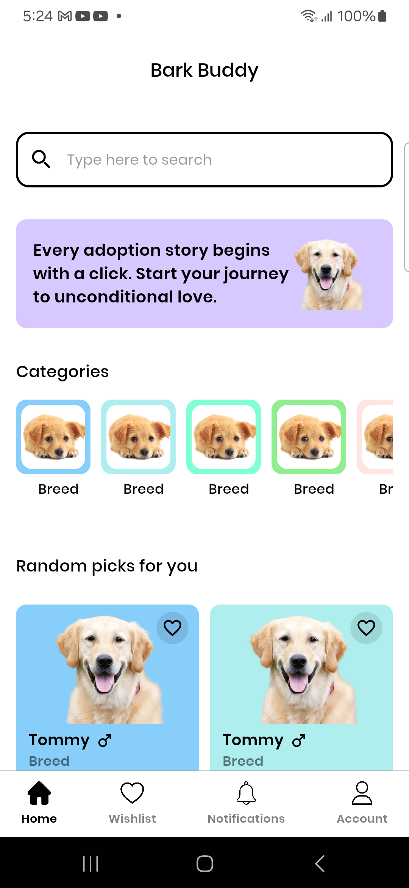
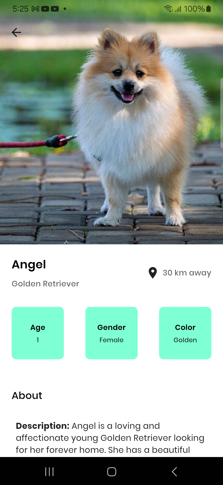
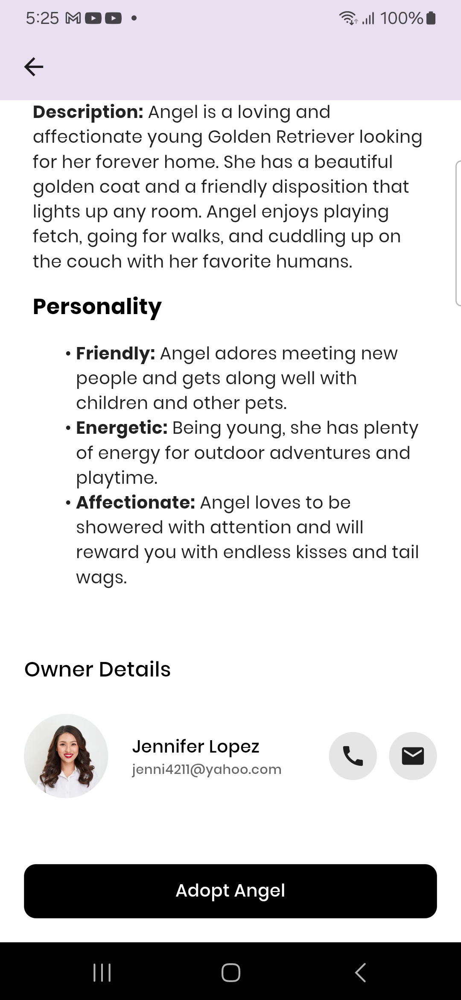
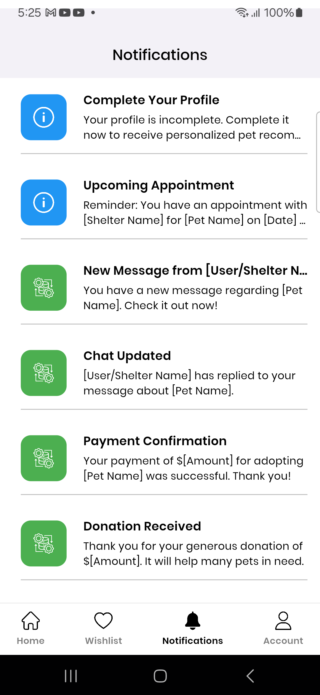
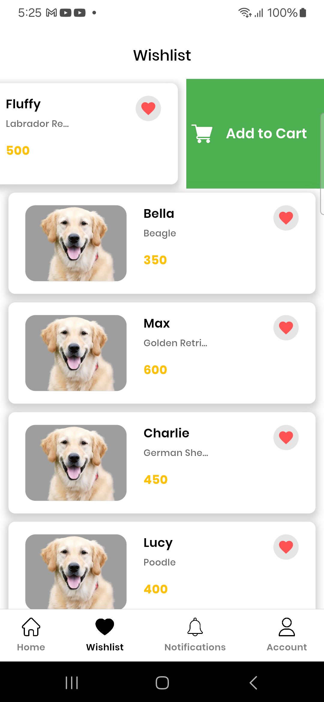
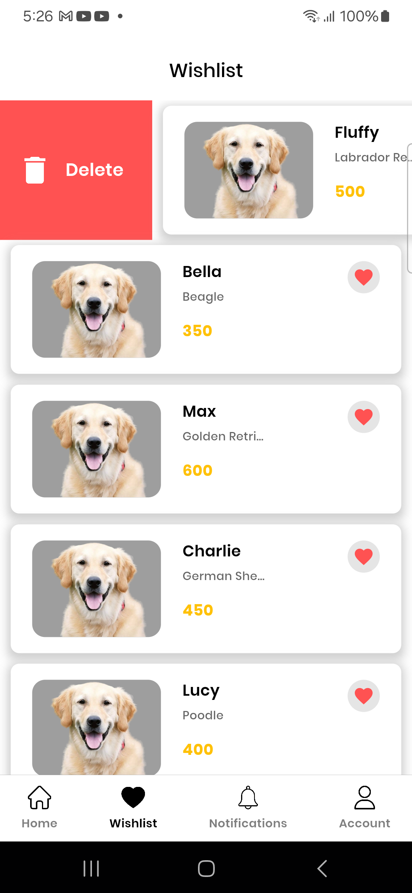
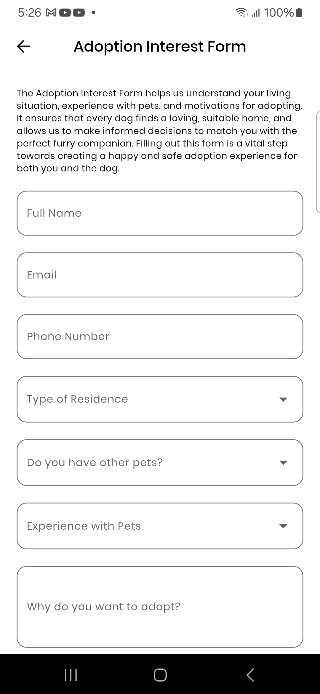

# Bark Buddy

A Flutter application for pet adoption, connecting potential adopters with rescue animals.

## Table of Contents

- [Features](#features)
- [Screenshots](#screenshots)
- [Getting Started](#getting-started)
    - [Prerequisites](#prerequisites)
    - [Installation](#installation)

- [Explanation](#explanation)

## Features

- Browse available pets for adoption
- Fill out adoption interest forms
- View adoption status and updates
- List of
- User friendly interface
- Browse available pets by category and location
- View detailed profiles and photos of pets
- Wishlist pets for future adoption

## Screenshots











## Getting Started

To get a local copy up and running, follow these steps:

### Prerequisites

- Flutter SDK
- Android Studio / Xcode
- Emulator or physical device

### Installation

1. Clone the repository
   ```bash
   git clone https://github.com/shiburajrs/Bark-Buddy.git

### Packages Used

Here are the key packages used in this project:

- **flutter_gen_runner:** Code generation for Flutter, facilitating type-safe access to resources.
- **build_runner:** A build system for Dart code generators.
- **flutter_html:** Render HTML content in Flutter widgets.
- **url_launcher:** Flutter plugin for launching a URL in the mobile platform's default browser

### Here are some websites that were helpful while developing this project:

- [Flutter Documentation](https://flutter.dev/docs): Official documentation for the Flutter framework.
- [Dart Package Repository](https://pub.dev): Official repository for Dart and Flutter packages.
- [Story Set](https://storyset.com/): Provides free illustrations for digital projects.
- [Flaticon](https://www.flaticon.com/): Database of free icons for personal and commercial use.


### Explanation:

- **Future Updates Section:** Added a new section titled "**Future Updates**" to explicitly mention that updates are in progress.
- **Content:** This section informs users that improvements and new features are underway, encouraging them to check back for updates.
